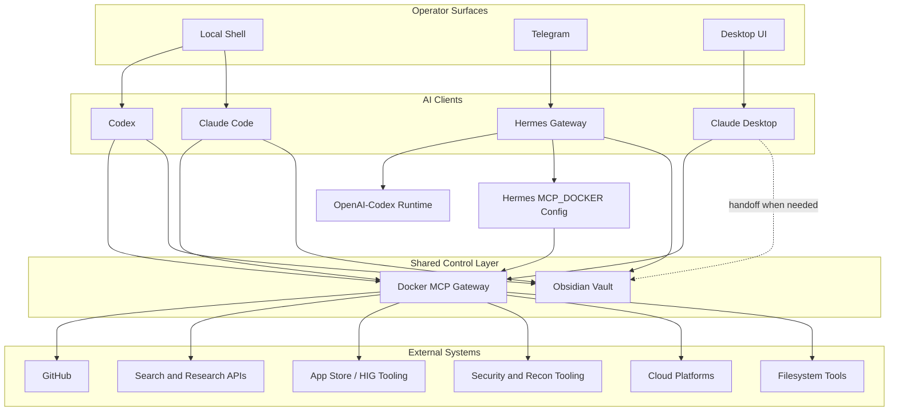

# Architecture

## Design Intent

The workstation is designed as a governed local AI operations environment. It keeps the operator fast while reducing the two failure modes that show up in real multi-agent setups: every client accumulating its own credentials, and every agent writing durable context to a different memory store.

## Reference Deployment

This public template mirrors a live Mac workstation as of May 27, 2026.

| Area | Public-safe detail |
|---|---|
| Primary command surfaces | Local shell, Codex, Claude Code, Claude Desktop, Telegram via Hermes. |
| Shared MCP baseline | `MCP_DOCKER` through `docker mcp gateway run`. |
| Docker MCP profile | Broad private server catalog behind the default profile; verify the current count before publishing inventory claims. |
| Globally registered Docker MCP clients | Codex, Claude Code, and Claude Desktop. |
| Hermes tool route | Hermes owns a separate `MCP_DOCKER` long-lived gateway block in its runtime config. |
| Durable memory | Obsidian vault path pattern: `$HOME/.openclaw/workspace/01-memory/`. |
| Public repo boundary | Templates, structure, and operating decisions only. Private state remains outside Git. |

## Control Plane



## Runtime Ownership

| Runtime | Primary ownership | Public template location |
|---|---|---|
| Codex | Review, repo hygiene, security posture, GitHub publishing, App Store ASO, HIG checks, and task triage. | `templates/codex/` |
| Claude Code | Active implementation, hooks, skills, test workflows, and project-local agents. | `templates/claude/` |
| Claude Desktop | Interactive research, artifact-style drafting, and visual exploration. | `templates/claude-desktop/` |
| Hermes | Telegram gateway, remote command surface, resumable sessions, and runtime routing. | `templates/hermes/` |
| Docker MCP | Shared external tool gateway and credential boundary. | `templates/docker-mcp/` |
| Obsidian | Durable memory and cross-agent handoff store. | `templates/obsidian/` |

## MCP Access Model

Docker MCP is the default boundary for shared tools. The private workstation keeps the broad server catalog in Docker and lets individual clients consume the gateway according to their job. The public Docker MCP files are representative templates, not a full export of the private profile.

- Codex uses a curated MCP lane for GitHub, search/context, App Store intelligence, HIG review, and security/recon work.
- Claude Code uses Docker MCP for project implementation support while retaining project-local hooks and agents.
- Claude Desktop is globally connected to Docker MCP and may have private direct local exceptions that are intentionally not generalized in this template.
- Hermes uses a long-lived Docker MCP gateway block inside its own runtime config rather than appearing as a normal global desktop client.

The practical rule: put shared tools in Docker MCP first. Add direct client-specific MCP servers only when the exception is intentional, documented, and not appropriate for the public baseline.

## Memory Model

Durable memory belongs in Obsidian, not in client-specific stores. Local client memory can exist for runtime mechanics, but cross-agent facts, launch notes, operating decisions, and handoff material should resolve back to:

```text
$HOME/.openclaw/workspace/01-memory/
```

The public template includes vault structure and policy only. It does not include actual memory notes.

## Secret Boundary

The repository stores:

- Tool names and routing patterns.
- Public-safe environment variable names.
- Placeholder values.
- Runbooks and verification commands.
- Sanitized inventory facts.

The repository does not store:

- Credential values.
- Authentication caches.
- Session state.
- Logs or transcripts.
- Raw memory notes.
- Client, finance, project, or personal operational data.

## Design Decisions

| Decision | Reason |
|---|---|
| Docker MCP first | Keeps external tools and credentials out of per-client drift. |
| Obsidian as durable memory | Creates a human-readable source of truth shared across agents and machines. |
| Separate runtime ownership | Prevents every model client from becoming a general-purpose catch-all. |
| Sanitized public template | Makes the architecture reusable without exposing the operator's private deployment. |
| Explicit verification commands | Lets maintainers validate live state before updating public claims. |
